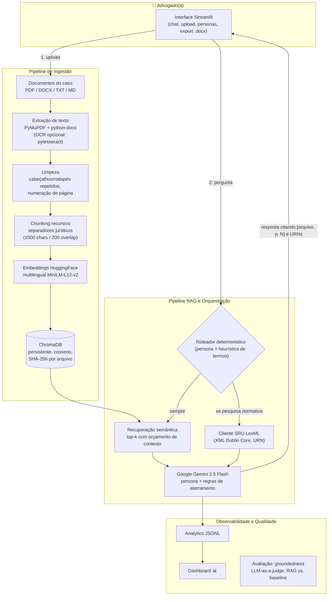

# ⚖️ Themis.IA — Copiloto Jurídico com RAG e Personas

> Assistente jurídico que analisa processos, pesquisa legislação/jurisprudência e minuta
> peças com IA generativa — com todas as respostas **aterradas** (grounded) nos documentos
> do caso e nas fontes oficiais, nunca em "memória" do modelo.

**Autor:** Emanuel Abreu · **Projeto individual** · Disciplina de Projetos de IA

---

## 1. Introdução

### 1.1 Contexto e motivação

A rotina jurídica exige ler volumes massivos de documentos (petições, contratos,
jurisprudências) e redigir peças complexas. LLMs de uso geral aceleram esse trabalho, mas
**alucinam leis e julgados** com frequência inaceitável para o domínio. O Themis.IA ataca
o problema com **RAG (Retrieval-Augmented Generation)**: as respostas são geradas apenas a
partir de trechos recuperados dos autos e de metadados oficiais do portal
[LexML](https://www.lexml.gov.br), com citação obrigatória das fontes.

### 1.2 Problema / pergunta de pesquisa

Como construir um sistema RAG unificado que permita interações seguras e especializadas
(personas: Analista, Estrategista, Redator, Pesquisador, Revisor, Didático) sobre
documentos jurídicos, preservando a privacidade dos dados e minimizando alucinação?

### 1.3 Hipótese

A arquitetura RAG com LLM em nuvem (Gemini) + system prompts de personas com **regras de
aterramento rígidas** reduz drasticamente a alucinação de citações em relação ao LLM puro
(baseline), mantendo groundedness ≥ 95% e latência aceitável (< 5 s até o início da
resposta), e acelera em ≥ 50% a síntese de peças jurídicas.

### 1.4 Objetivos

1. Sistema de busca vetorial persistente para indexação de peças e processos (até 150 MB/arquivo).
2. Módulo de personas (6 perfis) com roteamento determinístico de ferramentas.
3. Busca de legislação/jurisprudência real via **API SRU oficial do LexML**.
4. Interface Streamlit multiusuário estilo ChatGPT, restrita ao domínio do caso.
5. Protocolo de avaliação reprodutível (groundedness via LLM-as-a-judge, RAG vs. baseline).

## 2. Arquitetura



### Evolução sobre o design original (Advog.IA)

| # | Melhoria | Justificativa |
|---|---|---|
| 1 | **API SRU oficial do LexML** no lugar de scraping HTML | XML Dublin Core estável; parser tolerante a namespaces; testável offline com fixtures |
| 2 | **Degradação graciosa do LexML** | O portal usa desafio anti-bot; o sistema informa o bloqueio e segue com a base local em vez de quebrar |
| 3 | **Roteador determinístico de ferramentas** (auto/sempre/nunca) | Mais previsível e testável que um agente autônomo; menos chamadas de API (rate limits) |
| 4 | **Exportação .docx** das respostas | Era "trabalho futuro" no design original — entregue |
| 5 | **OCR opcional** (pytesseract) para PDFs escaneados | Era limitação declarada — entregue como módulo opcional |
| 6 | **Autenticação sem senha hardcoded** | Credenciais via `.env` (hash SHA-256, comparação em tempo constante) |
| 7 | **Deduplicação por SHA-256 + página de gestão da base** | Ingestão idempotente, rastreabilidade e remoção de documentos pela UI |
| 8 | **Limpeza de boilerplate testada** | Remoção de cabeçalhos/rodapés repetidos e numeração de página com testes unitários |
| 9 | **Embeddings multilíngues** (`paraphrase-multilingual-MiniLM-L12-v2`) | O texto-alvo é jurídico em pt-BR; o default anterior era anglocêntrico |
| 10 | **Dashboard de analytics** na própria UI | O design original só gravava o JSONL; aqui ele é visualizado (KPIs + gráficos acessíveis) |
| 11 | **Protocolo de avaliação executável** (`eval/`) | Groundedness e aderência à referência com juiz LLM, múltiplos runs (média ± desvio), RAG vs. baseline |
| 12 | **CI (GitHub Actions)** com testes unitários + smoke test | Reprodutibilidade verificada a cada push |

## 3. Dados

Dados **não estruturados fornecidos pelo usuário** (PDF/DOCX/TXT/MD) + metadados públicos
do LexML. Não há treinamento de modelo: os dados alimentam apenas o índice vetorial local.
Documentação completa (fontes, licenças, schema dos chunks, riscos, PII):
**[docs/data_card.md](docs/data_card.md)**.

Para demonstração e avaliação, o repositório inclui documentos **fictícios** em
[`data/exemplos/`](data/exemplos/) (um contrato de prestação de serviços e uma sentença
de ação de cobrança relacionados entre si).

## 4. Metodologia

- **Abordagem:** sistema híbrido — recuperação semântica (k-NN em espaço vetorial de
  cosseno) + geração por LLM em nuvem, estado da arte para Q&A de domínio específico sem
  re-treinar o modelo fundacional.
- **Stack:** Python 3.10+ · LangChain (core, text-splitters, chroma, huggingface,
  google-genai) · ChromaDB · Streamlit · PyMuPDF · python-docx · Altair.
- **Chunking:** `RecursiveCharacterTextSplitter` com separadores do domínio jurídico
  (`Art.`, `CLÁUSULA`, `§`, …) — 1000 caracteres, 200 de sobreposição — para não cortar
  dispositivos ao meio.
- **Aterramento:** system prompt de cada persona + regras de aterramento compartilhadas
  (fontes obrigatórias, citação `[arquivo, p. N]` / URN, recusa explícita quando a
  informação não está nas fontes).
- **Baseline:** o mesmo LLM (`gemini-2.5-flash`) **sem** injeção de contexto, avaliado
  contra o mesmo contexto recuperado (que ele não recebeu) — mede quanto o RAG contribui.
- **Semente global:** 42 (`SEED` no `.env`); temperatura de geração 0.2 (juiz: 0.0).

### Protocolo de validação

`eval/questions.json` traz 8 perguntas canônicas com respostas de referência sobre o
corpus de exemplo. Para cada pergunta, o juiz LLM (LLM-as-a-judge) recebe os trechos
recuperados, a resposta e a referência, e retorna:

- **Groundedness** — fração das afirmações da resposta sustentadas pelos trechos-fonte;
- **Reference match** — se a resposta contém a informação essencial da referência;
- **Latência** — total e somente LLM.

Com `--runs N`, o protocolo reporta média ± desvio-padrão entre execuções.

### Métricas e critérios de sucesso

| Métrica | Mínimo aceitável |
|---|---|
| Latência de resposta (prompt médio) | < 5 s |
| Groundedness (fidelidade ao contexto) | ≥ 95% |
| Reference match (aderência à referência) | ≥ 80% |

## 5. Resultados

Os resultados são gerados de forma reprodutível pelos comandos abaixo (exigem
`GOOGLE_API_KEY`); os JSONs ficam em `eval/results_{rag,baseline}.json`:

```bash
make seed-db          # indexa o corpus de exemplo
make eval             # RAG, 3 runs
make eval-baseline    # LLM puro, 3 runs
```

Como referência, o estudo que inspirou este projeto reportou, no mesmo protocolo
(Gemini 2.5 Flash), groundedness de ~35% para o baseline sem RAG contra ~96% com RAG, com
latência de ~2,5 s vs. ~4,0 s — o RAG paga ~1,5 s de latência para quase eliminar a
alucinação de fontes. A análise de erros esperada: PDFs com tabelas complexas divididas
entre páginas e escaneamentos sem OCR degradam a indexação (mitigável com `OCR_ENABLED`).

## 6. Reprodutibilidade

### 6.1 Requisitos

- Python 3.10+ (testado em 3.12 / Linux)
- Chave da API do Google AI Studio (gratuita): <https://aistudio.google.com/apikey>
- ~2 GB de disco (PyTorch CPU + modelo de embeddings)

### 6.2 Instalação

```bash
git clone https://github.com/emanuelabreudev/themis-ia.git
cd themis-ia

make setup            # venv + PyTorch CPU + dependências fixadas
# ou, manualmente:
#   python3 -m venv .venv && source .venv/bin/activate
#   pip install torch --index-url https://download.pytorch.org/whl/cpu
#   pip install -r requirements.txt

cp .env.example .env  # e preencha GOOGLE_API_KEY, APP_USERNAME, APP_PASSWORD
```

O ambiente de referência completo está congelado em `requirements.lock`.

### 6.3 Execução

```bash
make seed-db     # opcional: popula a base com os documentos fictícios de exemplo
make run         # http://localhost:8501
```

Login: credenciais definidas no `.env` (padrão de desenvolvimento: `admin` / `themis123`
— a UI alerta enquanto a senha padrão estiver em uso).

Valide o RAG: selecione a persona **🔍 Analista de Documentos**, faça upload de um PDF (ou
use o corpus de exemplo) e pergunte sobre ele; confira as fontes citadas no expander da
resposta e exporte a minuta em .docx.

### 6.4 Testes

```bash
make test     # 22 testes unitários (offline, sem downloads)
make smoke    # end-to-end: ingestão real + recuperação semântica (baixa o modelo de embeddings)
```

O CI (GitHub Actions) executa ambos a cada push.

### 6.5 Artefatos gerados

- `chroma_db/` — embeddings e documentos vetorizados (persistente);
- `data/analytics/search_analytics.jsonl` — log de consultas/ingestões (dashboard 📊);
- `eval/results_*.json` — resultados do protocolo de avaliação.

## 7. Estrutura do repositório

```
themis-ia/
├── app.py                        # Interface principal (chat)
├── pages/
│   ├── 1_📚_Base_de_Conhecimento.py
│   └── 2_📊_Analytics.py
├── src/
│   ├── config.py                 # Configurações via .env
│   ├── auth.py                   # Login (hash SHA-256, tempo constante)
│   ├── analytics.py              # Log JSONL de eventos
│   ├── export.py                 # Exportação de respostas para .docx
│   ├── ui.py                     # Componentes Streamlit compartilhados
│   ├── ingestion/                # extractors → chunking → pipeline
│   ├── rag/                      # vector_store, retriever, personas, engine
│   └── tools/lexml.py            # Cliente SRU do LexML
├── eval/                         # Protocolo de avaliação + perguntas canônicas
├── tests/                        # Unitários + smoke test (marker slow)
├── scripts/setup_db.py           # Seed da base com data/exemplos/
├── docs/data_card.md             # Data card completo
├── requirements.txt              # Dependências diretas fixadas
├── requirements.lock             # Freeze completo do ambiente de referência
└── .github/workflows/ci.yml      # CI: unitários + smoke test
```

## 8. Limitações e trabalhos futuros

**Limitações:** dependência de internet e das cotas da API Gemini; o portal LexML pode
bloquear acesso automatizado (o sistema degrada para a base local); OCR requer instalação
do Tesseract no sistema; documentos sob sigilo absoluto não devem ser enviados na versão MVP.

**Futuros:** suporte a modelos de visão para evidências visuais em PDFs; reranking
(cross-encoder) sobre o top-k; histórico de chats persistente entre sessões; RAGAS
completo na esteira de CI; multiusuário com papéis.

## ⚠️ Aviso legal

> As teses e redações geradas pelo Themis.IA **não substituem a análise humana rigorosa**
> de um(a) advogado(a) responsável. O sistema é uma ferramenta de apoio.
